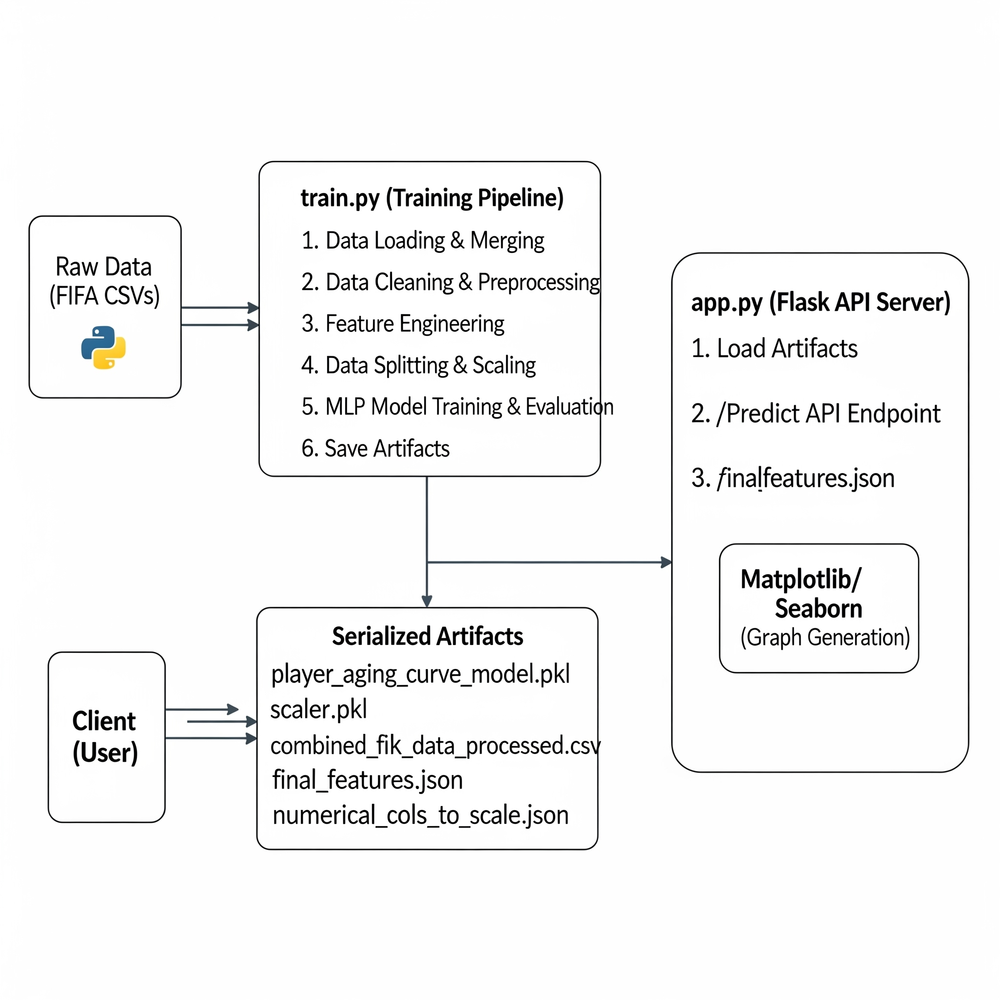

# **축구 선수 에이징 커브 예측 모델 (Player Aging Curve Prediction Model)**

## **1. 개요 (Abstract)**

본 프로젝트는 EA Sports FIFA 시리즈의 선수 데이터를 기반으로, 축구 선수의 능력치 변화, 즉 '에이징 커브(Aging Curve)'를 예측하는 머신러닝 모델 및 웹 애플리케이션입니다. 선수의 나이, 신체 정보, 소속 클럽, 국적, 그리고 세부 능력치 등 다차원적인 데이터를 활용하여 미래의 overall_rating 변화량을 예측합니다.

핵심 모델로는 Scikit-learn의 다층 퍼셉트론(Multi-Layer Perceptron, MLP) 회귀 모델을 사용하였으며, 수집된 원시 데이터를 정제하고 유의미한 특성을 추출하는 정교한 전처리 및 특성 공학 파이프라인을 구축했습니다. 학습된 모델은 Flask 기반의 API 서버를 통해 배포되어, 특정 선수의 이름을 입력하면 과거 실제 데이터와 미래 예측 데이터를 종합하여 에이징 커브를 시각화된 그래프로 제공합니다. 이를 통해 구단 스카우터, 에이전트, 혹은 게임 유저들이 선수의 잠재적 성장 또는 기량 하락을 객관적인 데이터에 기반하여 분석하고 예측하는 데 도움을 주는 것을 목표로 합니다.

## **2. 연구 배경 및 목표 (Introduction)**

축구계에서 '에이징 커브'는 선수의 커리어에 따른 기량 변화를 나타내는 매우 중요한 개념입니다. 일반적으로 선수는 20대 후반에 기량의 정점을 찍고 이후 점진적으로 하락하는 경향을 보이지만, 이는 포지션, 신체 능력, 자기 관리 등 다양한 요인에 따라 개인별로 큰 편차를 보입니다. 이러한 에이징 커브를 정확히 예측하는 것은 구단의 장기적인 선수 영입 전략, 재계약 협상, 유망주 발굴 등에 있어 핵심적인 의사결정 요소가 됩니다.

본 연구는 방대하고 정형화된 FIFA 게임 데이터를 활용하여, 기존의 주관적 평가를 넘어선 데이터 기반의 선수 에이징 커브 예측 모델을 개발하는 것을 목표로 합니다.

**주요 목표:**

1.  **데이터 통합 및 정제:** 여러 버전에 걸친 FIFA 선수 데이터를 통합하고, 결측치 및 비정형 데이터를 처리하여 분석 가능한 형태로 정제합니다.
2.  **특성 공학:** 선수의 연차별 능력치 변화를 정량적으로 표현하는 타겟 변수(performance_change)를 정의하고, 모델 학습에 유용한 파생 변수를 생성합니다.
3.  **예측 모델 구축:** 다층 퍼셉트론(MLP) 신경망 모델을 사용하여, 선수의 복합적인 특성들이 다음 해의 능력치 변화에 미치는 영향을 학습합니다.
4.  **시뮬레이션 및 시각화:** 특정 선수의 과거 데이터를 기반으로 미래의 능력치 변화를 연쇄적으로 예측(Iterative Prediction)하고, 그 결과를 실제 데이터와 함께 시각화하여 직관적인 분석을 지원합니다.
5.  **API 기반 서비스화:** 학습된 모델을 Flask 웹 프레임워크를 통해 API로 배포하여, 외부에서 쉽게 예측 결과를 요청하고 활용할 수 있는 시스템을 구축합니다.

## **3. 시스템 아키텍처 (System Architecture)**

본 시스템은 크게 **모델 학습 파이프라인(train.py)**과 **예측 서비스 API(app.py)** 두 가지 핵심 모듈로 구성됩니다.

## **4. 상세 연구 방법론 (Methodology)**

### **4.1. 데이터 수집 및 전처리 (train.py)**

1.  **데이터 소스:** players_15.csv부터 players_23.csv까지 총 9개년의 FIFA 선수 데이터를 사용합니다.
2.  **데이터 통합:** 각 연도별 데이터를 순회하며 로드한 후, year 컬럼을 추가하여 하나의 DataFrame으로 병합합니다.
3.  **초기 필터링:** 분석에 불필요하거나 노이즈가 될 수 있는 컬럼들(예: player_url, player_face_url 등)을 대거 제거합니다. 또한, 골키퍼는 일반 필드 플레이어와 성장 곡선이 상이할 가능성이 높아 분석에서 제외합니다.
4.  **데이터 정제 (Cleaning):**
    * **금액(Value/Wage):** 문자열 형태의 금액(€10.5M, €500K)을 숫자(float) 형태로 변환하는 clean_value_wage 함수를 적용합니다.
    * **신체 정보(Height/Weight):** 피트/인치(5'10")와 센티미터(178cm), 파운드(154lbs)와 킬로그램(70kg) 등 혼용된 단위를 각각 cm와 kg으로 통일합니다.
    * **결측치 처리:**
        * market_value_eur, wage_eur 등 핵심 수치형 데이터에 결측치가 있는 행은 제거합니다.
        * work_rate, body_type 등 범주형 데이터의 결측치는 'Unknown' 또는 'N/A'와 같은 별도의 카테고리로 처리합니다.
5.  **데이터 타입 변환:** 모든 수치형 데이터는 float64 또는 int64로, 범주형 데이터는 object 타입으로 명확히 변환하여 일관성을 유지합니다.

### **4.2. 특성 공학 (Feature Engineering) (train.py)**

1.  **타겟 변수(Target Variable) 정의:**
    * 모델의 예측 목표는 선수의 1년 후 overall_rating 변화량입니다.
    * 이를 위해 각 선수(player_id)별로 데이터를 연도순으로 정렬한 후, 다음 해의 overall_rating에서 현재 연도의 overall_rating을 뺀 값을 performance_change라는 타겟 변수(Y)로 정의합니다.
    * Y = overall_rating(t+1) - overall_rating(t)
    * 이 과정에서 마지막 연도 데이터는 다음 해 정보가 없으므로 타겟 변수를 계산할 수 없어 학습 데이터에서 제외됩니다.
2.  **입력 특성(Input Features) 생성:**
    * **age:** year와 birth_date를 이용하여 각 데이터 시점의 선수 나이를 계산합니다.
    * **범주형 데이터 인코딩:** nationality, club_name, preferred_foot, work_rate, body_type 등 문자열로 된 범주형 특성들을 pd.get_dummies를 사용하여 원-핫 인코딩(One-Hot Encoding)으로 변환합니다. 이는 모델이 범주 간의 서열 관계를 잘못 학습하는 것을 방지합니다.
    * **최종 특성 선택:** 타겟 변수(performance_change)와 직접적으로 관련된 overall_rating의 미래 값, 그리고 선수 식별자(player_id, player_name 등)를 제외한 모든 수치형 및 원-핫 인코딩된 특성을 최종 입력 데이터(X)로 사용합니다.

### **4.3. 모델 구조 및 학습 (train.py)**

1.  **데이터 스케일링:**
    * 신경망 모델은 특성들의 스케일에 민감하므로, StandardScaler를 사용하여 모든 수치형 입력 특성들을 표준화(평균 0, 분산 1)합니다.
    * 이때 사용된 scaler 객체는 scaler.pkl 파일로 저장하여, 예측 시에도 동일한 기준으로 데이터를 변환하는 데 사용됩니다.
2.  **데이터 분할:** 전처리된 전체 데이터를 학습 데이터(80%)와 테스트 데이터(20%)로 분할합니다 (train_test_split).
3.  **모델 아키텍처:**
    * **모델:** sklearn.neural_network.MLPRegressor
    * **은닉층(Hidden Layers):** (256, 128, 64) - 3개의 은닉층으로 구성되며, 각 층은 256, 128, 64개의 뉴런을 가집니다.
    * **활성화 함수(Activation Function):** relu - 비선형 관계를 학습하기 위해 Rectified Linear Unit 함수를 사용합니다.
    * **최적화 알고리즘(Solver):** adam - 효율적인 경사 하강법 알고리즘으로 널리 사용됩니다.
    * **기타 하이퍼파라미터:**
        * batch_size: 256
        * learning_rate: 'adaptive'
        * max_iter: 50
        * early_stopping: True (검증 점수가 개선되지 않으면 조기 종료하여 과적합 방지)
4.  **학습 및 평가:**
    * model.fit(X_train, Y_train)을 통해 모델을 학습합니다.
    * 학습된 모델을 사용하여 테스트 데이터(X_test)의 결과를 예측하고, 실제 값(Y_test)과 비교하여 모델 성능을 평가합니다.
    * **평가 지표:**
        * **MSE (Mean Squared Error):** 예측 오차의 제곱 평균.
        * **R² Score (결정 계수):** 모델이 데이터의 분산을 얼마나 잘 설명하는지를 나타내는 지표 (1에 가까울수록 좋음).

### **4.4. 예측 로직 및 시각화 (app.py)**

1.  **선수 데이터 조회:**
    * 사용자가 선수 이름을 입력하면, combined_fifa_data_processed.csv에서 해당 선수의 모든 과거 데이터를 조회합니다.
    * **player_id 불일치 문제 해결:** 동일 선수임에도 연도별로 player_id가 달라지는 경우가 있습니다. 예측의 일관성을 위해, 해당 선수의 가장 최근 player_id를 기준으로 삼아 미래 데이터를 생성합니다.
2.  **미래 데이터 시뮬레이션:**
    * 선수의 마지막 실제 데이터(가장 최근 연도)를 기반으로, 예측하고자 하는 미래 연도(최대 5년)까지의 가상 데이터프레임을 생성합니다.
    * year와 age는 1씩 증가시키고, 나머지 능력치는 이전 연도의 값을 그대로 사용합니다.
3.  **연쇄적 예측 (Iterative Prediction):**
    * 미래 첫 해(t+1)의 데이터를 모델에 입력하여 performance_change를 예측합니다.
    * 예측된 performance_change를 이전 해(t)의 overall_rating 및 관련 능력치에 더하여 t+1년의 새로운 능력치를 생성합니다.
    * 이 업데이트된 t+1년의 데이터를 다시 모델의 입력으로 사용하여 t+2년의 performance_change를 예측합니다.
    * 이 과정을 목표 연도까지 반복하여 선수의 미래 성장 곡선을 시뮬레이션합니다.
4.  **시각화:**
    * matplotlib과 seaborn 라이브러리를 사용하여 시계열 그래프를 생성합니다.
    * **X축:** 연도 (year)
    * **Y축:** 누적 능력치 변화 (cumulative_performance_change) - 기준 연도로부터의 overall_rating 변화 총합
    * 그래프에는 선수의 과거 실제 능력치 변화와 미래 예측 변화가 함께 표시되어 직관적인 비교가 가능합니다.
    * 생성된 그래프는 io.BytesIO를 통해 메모리상에서 Base64로 인코딩되어 JSON 응답에 포함됩니다.

## **5. 설치 및 실행 방법 (Installation & Usage)**

### **5.1. 요구사항 (Prerequisites)**

* Python 3.8 이상
* pip

### **5.2. 설치 (Installation)**

1.  **저장소 복제:**
    git clone https://github.com/your-username/player-aging-curve.git
    cd player-aging-curve
2.  **필요 라이브러리 설치:**
    pip install -r requirements.txt
3.  데이터 준비:
    프로젝트 루트 디렉토리에 players_15.csv, players_16.csv, ..., players_23.csv 파일을 위치시켜야 합니다. (Kaggle 등에서 다운로드 가능)

### **5.3. 실행 순서**

#### **단계 1: 모델 학습**

예측 서버를 실행하기 전에, 반드시 모델 학습 스크립트를 먼저 실행하여 필요한 결과물(모델, 스케일러 등)을 생성해야 합니다.
`python train.py`
이 스크립트는 실행에 수 분에서 수십 분이 소요될 수 있습니다. 실행이 완료되면 프로젝트 루트에 .pkl, .csv, .json 파일들이 생성됩니다.

#### **단계 2: 예측 서버 실행**

**개발 환경:**
`flask run`
서버는 기본적으로 http://127.0.0.1:5000에서 실행됩니다.
**배포 환경:**
gunicorn을 사용하여 더 안정적으로 서버를 실행할 수 있습니다.
`gunicorn --workers 4 --bind 0.0.0.0:8000 app:app`

### **5.4. 사용법**

#### **API 엔드포인트**

* **URL:** /predict
* **Method:** POST
* **Body (JSON):**
    {
    "player_name": "Son Heung-Min",
    "max_years": 5
    }
    * player_name: 예측을 원하는 선수의 정확한 이름
    * max_years: 예측할 미래 연도 수 (기본값: 5)

#### **예시: curl을 이용한 요청**

`curl -X POST -H "Content-Type: application/json" \`
`-d '{"player_name": "Son Heung-Min", "max_years": 5}' \`
`http://127.0.0.1:5000/predict`

#### **성공 응답 예시 (JSON)**

{
"actual_data": \[
{"year": 2015, "cumulative_performance_change": 0.0, "overall_rating": 77.0},
{"year": 2016, "cumulative_performance_change": 1.0, "overall_rating": 78.0},
...
\],
"plot_url": "data:image/png;base64,iVBORw0KGgoAAAANSUhEUg...",
"predicted_data": \[
{"year": 2023, "cumulative_performance_change": -0.85, "overall_rating": 86.15},
{"year": 2024, "cumulative_performance_change": -1.95, "overall_rating": 85.05},
...
\]
}

* plot_url의 Base64 데이터를 이미지로 변환하면 에이징 커브 그래프를 확인할 수 있습니다.

#### **유틸리티: 선수 이름 확인 (check_names.py)**

데이터셋에 포함된 선수의 정확한 영문 이름을 모를 경우, check_names.py 스크립트를 사용하여 확인할 수 있습니다.

1.  check_names.py 파일을 열어 player_to_check 변수에 확인하고 싶은 선수 이름을 입력합니다.
2.  스크립트를 실행합니다.
    `python check_names.py`
    해당 선수가 존재하면 연도별 player_id와 함께 정확한 이름을 출력해줍니다.

## **6. 파일 구조 (File Structure)**

├── app.py                      # Flask 예측 API 서버
├── check_names.py              # 선수 이름 및 ID 확인 유틸리티
├── player_aging_curve_model.pkl  # (생성됨) 직렬화된 Scikit-learn 모델
├── scaler.pkl                  # (생성됨) 직렬화된 StandardScaler 객체
├── combined_fifa_data_processed.csv # (생성됨) 전처리 완료된 통합 데이터
├── final_features.json         # (생성됨) 모델 학습에 사용된 특성 목록
├── numerical_cols_to_scale.json # (생성됨) 스케일링이 적용된 수치형 특성 목록
├── requirements.txt            # Python 라이브러리 의존성 목록
├── train.py                    # 모델 학습 및 데이터 전처리 파이프라인
└── data/                       # (필요) players_15.csv ~ players_23.csv 원본 데이터 위치

## **7. 결론 및 향후 과제 (Conclusion & Future Work)**

본 프로젝트는 FIFA 데이터를 활용하여 선수의 에이징 커브를 예측하는 MLP 모델을 성공적으로 구축하고, 이를 Flask API를 통해 서비스화했습니다. 데이터 정제, 특성 공학, 연쇄적 예측 로직 구현을 통해 선수의 커리어 궤적에 대한 데이터 기반의 통찰력을 제공할 수 있음을 확인했습니다.

**향후 과제:**

1.  **모델 고도화:** LSTM, GRU와 같은 시계열 데이터에 특화된 딥러닝 모델을 도입하여 선수의 시간에 따른 능력치 변화 패턴을 더 정교하게 학습할 수 있습니다.
2.  **특성 추가:** 부상 이력, 경기 출전 시간, 실제 경기 스탯(골, 어시스트 등)과 같은 외부 데이터를 추가하여 예측 정확도를 향상시킬 수 있습니다.
3.  **웹 인터페이스 개발:** 현재 API 형태로 제공되는 서비스를 사용자가 더 쉽게 이용할 수 있도록 프론트엔드 웹 인터페이스를 구축합니다.
4.  **클라우드 배포:** 모델과 API를 AWS, GCP 등 클라우드 플랫폼에 배포하여 확장성과 안정성을 확보합니다.
5.  **포지션별 모델링:** 필드 플레이어 전체를 대상으로 하는 단일 모델 대신, 공격수, 미드필더, 수비수 등 포지션별로 특화된 에이징 커브 모델을 각각 구축하여 예측 성능을 높일 수 있습니다.
